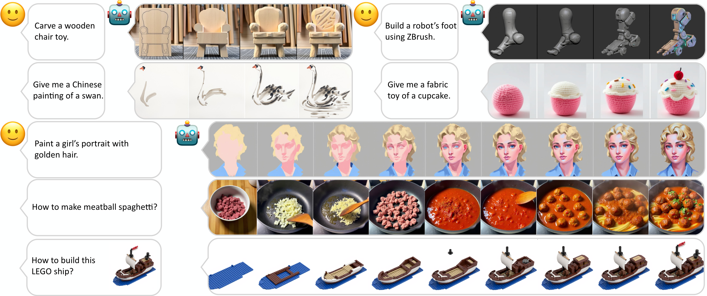

# MakeAnything

 

> **MakeAnything: Harnessing Diffusion Transformers for Multi-Domain Procedural Sequence Generation**
>  
> [Yiren Song](https://scholar.google.com.hk/citations?user=L2YS0jgAAAAJ), 
> [Cheng Liu](https://scholar.google.com.hk/citations?hl=zh-CN&user=TvdVuAYAAAAJ), 
> and 
> [Mike Zheng Shou](https://sites.google.com/view/showlab)
>  
> [Show Lab](https://sites.google.com/view/showlab), National University of Singapore
>  
