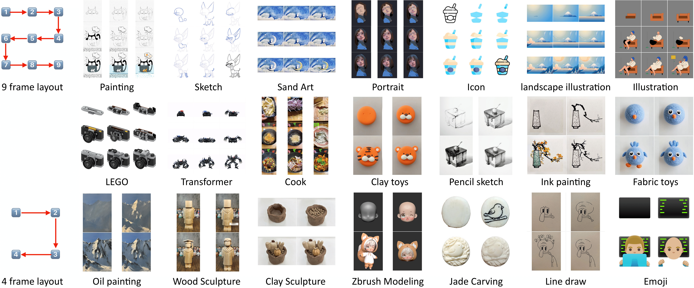

# MakeAnything

> **MakeAnything: Harnessing Diffusion Transformers for Multi-Domain Procedural Sequence Generation**
> <br>
> [Yiren Song](https://scholar.google.com.hk/citations?user=L2YS0jgAAAAJ), 
> [Cheng Liu](https://scholar.google.com.hk/citations?hl=zh-CN&user=TvdVuAYAAAAJ), 
> and 
> [Mike Zheng Shou](https://sites.google.com/view/showlab)
> <br>
> [Show Lab](https://sites.google.com/view/showlab), National University of Singapore
> <br>

<a href="https://arxiv.org/abs/2502.01572"></a>

<br>


## Configuration
### 1. **Environment setup**
```bash
git clone https://github.com/showlab/MakeAnything.git
cd MakeAnything

conda create -n makeanything python=3.11.10
conda activate makeanything
```
### 2. **Requirements installation**
```bash
pip install torch==2.5.1 torchvision==0.20.1 torchaudio==2.5.1 --index-url https://download.pytorch.org/whl/cu124
pip install --upgrade -r requirements.txt

accelerate config
```

## Asymmetric LoRA
### 1. Weights
 You can download the trained checkpoints of Asymmetric LoRA & LoRA for inference. Below are the details of available models:

| **Model**  |  **Description**  |  **Resolution** |
|:-:|:-:|:-:|
| [asylora_9f_general](www.toBeReleased.com) | The Asymmetric LoRA has been fine-tuned on all 9-frames datasets. *Index of lora_up*: `1:LEGO` `2:Cook` `3:Painting` `4:Icon` `5:Landscape illustration` `6:Portrait` `7:Transformer` `8:Sand art` `9:Illustration` `10:Sketch` | 1056,1056 |
| [asylora_4f_general](www.toBeReleased.com) | The Asymmetric LoRA has been fine-tuned on all 9-frames datasets. *Index of lora_up: (0~9 same as 9f),* `11:Clay toys` `12:Clay sculpture` `13:Zbrush Modeling` `14:Wood sculpture` `15:Ink painting` `16:Pencil sketch` `17:Fabric toys` `18:Oil painting` `19:Jade Carving` `20:Line draw` `21:Emoji` | 1024,1024 |

### 2. Training
#### 2.1 Settings for dataset
The training process relies on paired dataset consisting of text captions and images. Each dataset folder contains both `.caption` and `.png` files, where the filenames of the caption files correspond directly to the image filenames. Here is an example of the organized dataset.

```
dataset/
├── portrait_001.png
├── portrait_001.caption
├── portrait_002.png
├── portrait_002.caption
├── lego_001.png
├── lego_001.caption
```

The `.caption` files contain a **single line** of text that serves as a prompt for generating the corresponding image. The prompt **must specify the index of the lora_up** used for that particular training sample in the Asymmetric LoRA. The format for this is `--lora_up <index>`, where `<index>` is the current B matrice index in the Asymmetric LoRA, refers to the certain domain used in the training, and index should **start from 1**, not 0. 

For example, a .caption file for a portrait painting sequence might look as follows:

```caption
3*3 of 9 sub-images, step-by-step portrait painting process, 1 girl --lora_up 6
```

Then, you should organize your **dataset configuration file** written in `TOML`. Here is an example: 

```toml
[general]
enable_bucket = false

[[datasets]]
resolution = 1056
batch_size = 1

  [[datasets.subsets]]
  image_dir = '/path/to/dataset/'
  caption_extension = '.caption'
  num_repeats = 1
```

It is recommended to set batch size to 1 and set resolution to 1024 (4-frames) or 1056 (9-frames).

#### 2.2 Start training
We have provided a template file for training Asymmetric LoRA in `scripts/asylora_train.sh`. Simply replace corresponding paths with yours to start the training. Note that `lora_ups_num` in the script is the total number of B matrices used in Asymmetric LoRA that you specified during training.

```bash
chmod +x scripts/asylora_train.sh
scripts/asylora_train.sh
```

Additionally, if you are directly **using our dataset for training**, the `.caption` files in our released dataset do not specify the `--lora_up <index>` field. You will need to organize and update the `.caption` files to include the appropriate `--lora_up <index>` values before starting the training.

### 3. Inference
We have also provided a template file for inference Asymmetric LoRA in `scripts/asylora_inference.sh`. Once the training is done, replace file paths and run inference. Note that `lora_up_cur` in the script is the current number of B matrice index to be used for inference.

```bash
chmod +x scripts/asylora_inference.sh
scripts/asylora_train.sh
```


## Recraft Model
### 1. Weights
You can download the trained checkpoints of Recraft Model for inference. Below are the details of available models:
| **Model**  |  **Description**  |  **Resolution** |
|:-:|:-:|:-:|
| [recraft_9f_lego ](www.toBeReleased.com) | The Recraft Model has been trained on `LEGO` dataset. Support `9-frames` generation. | 1056,1056 |
| [recraft_9f_portrait ](www.toBeReleased.com) | The Recraft Model has been trained on `Portrait` dataset. Support `9-frames` generation. | 1056,1056 |
| [recraft_9f_sketch ](www.toBeReleased.com) | The Recraft Model has been trained on `Sketch` dataset. Support `9-frames` generation. | 1056,1056 |
| [recraft_4f_wood_sculpture ](www.toBeReleased.com) | The Recraft Model has been trained on `Wood sculpture` dataset. Support `4-frames` generation. | 1024,1024 |

### 2. Training
To be released.
### 3. Inference
To be released.

## Datasets
To be released.


## Results
### Text-to-Sequence Generation (LoRA & Asymmetric LoRA)


### Image-to-Sequence Generation (Recraft Model)


### Generalization on Unseen Domains


## Citation
```
@inproceedings{Song2025MakeAnythingHD,
  title={MakeAnything: Harnessing Diffusion Transformers for Multi-Domain Procedural Sequence Generation},
  author={Yiren Song and Cheng Liu and Mike Zheng Shou},
  year={2025},
  url={https://api.semanticscholar.org/CorpusID:276107845}
}
```