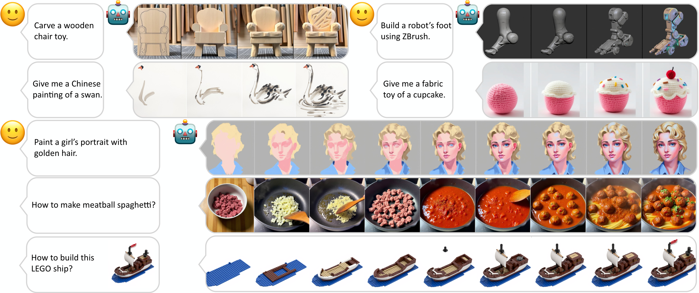
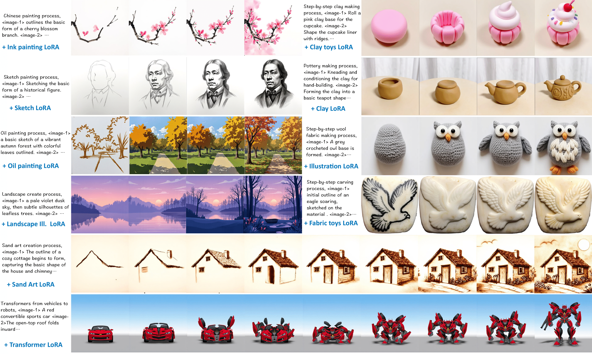
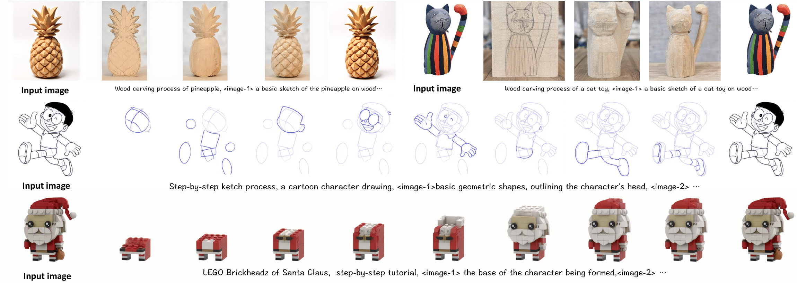
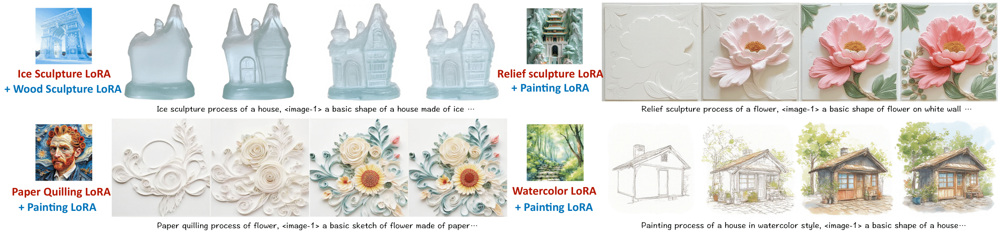

# MakeAnything

> **MakeAnything: Harnessing Diffusion Transformers for Multi-Domain Procedural Sequence Generation**
> <br>
> [Yiren Song](https://scholar.google.com.hk/citations?user=L2YS0jgAAAAJ), 
> [Cheng Liu](https://scholar.google.com.hk/citations?hl=zh-CN&user=TvdVuAYAAAAJ), 
> and 
> [Mike Zheng Shou](https://sites.google.com/view/showlab)
> <br>
> [Show Lab](https://sites.google.com/view/showlab), National University of Singapore
> <br>

<a href="https://arxiv.org/abs/2502.01572"></a>

<br>




## Quick Start
### Configuration
1. **Environment setup**
```bash
git clone https://github.com/showlab/MakeAnything.git
cd MakeAnything
conda create -n makeanything python=3.11.10
conda activate makeanything
```
2. **Requirements installation**
```bash
pip install torch==2.5.1 torchvision==0.20.1 torchaudio==2.5.1 --index-url https://download.pytorch.org/whl/cu124
pip install --upgrade -r requirements.txt
```

### Asymmetric LoRA
1. **Weights**
    To be released.
2. **Train**
    To be released.
3. **Inference**
    To be released.


### Recraft Model
1. **Weights**
    To be released.
2. **Train**
    To be released.
3. **Inference**
    To be released.

## Results
### Text-to-Sequence Generation (LoRA & Asymmetric LoRA)


### Image-to-Sequence Generation (Recraft Model)


### Generalization on Unseen Domains
