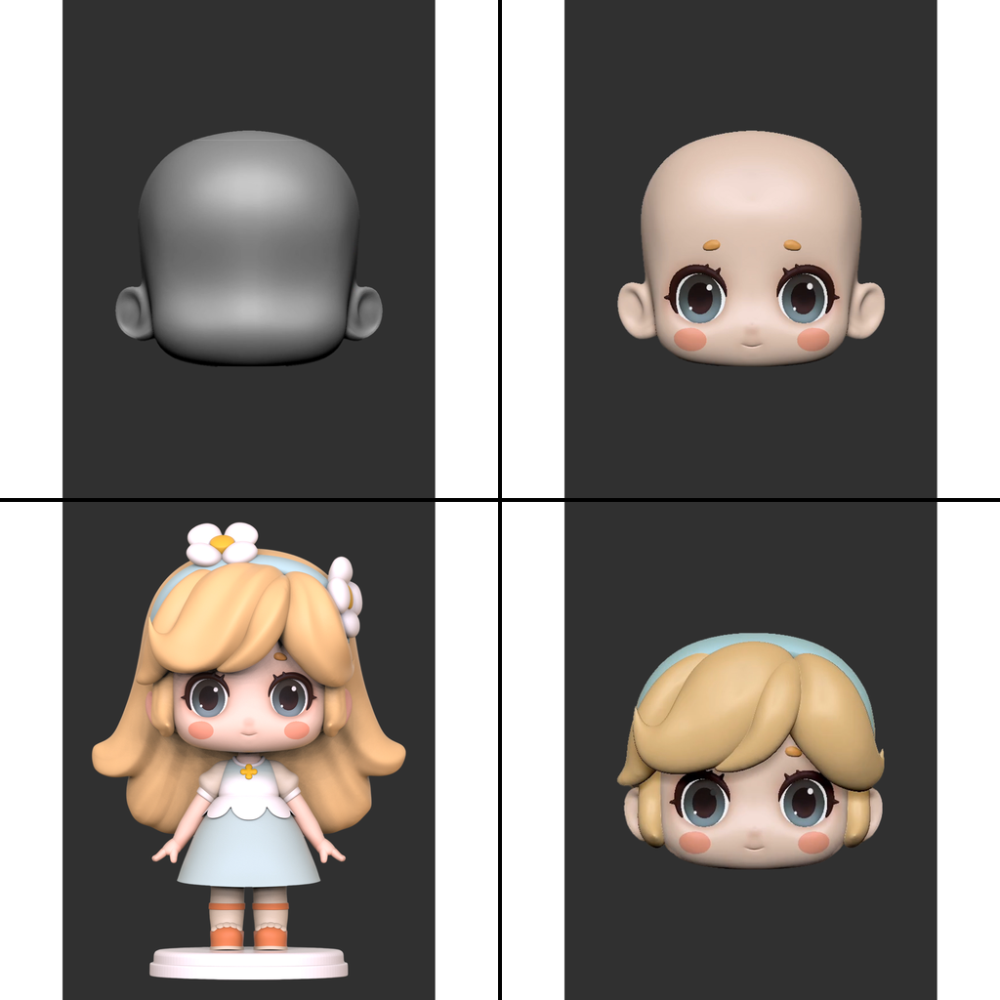
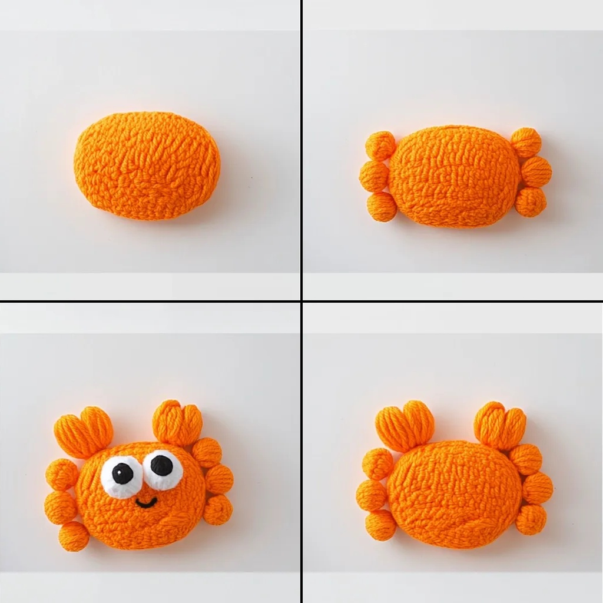

# MakeAnything

> **MakeAnything: Harnessing Diffusion Transformers for Multi-Domain Procedural Sequence Generation**
> <br>
> [Yiren Song](https://scholar.google.com.hk/citations?user=L2YS0jgAAAAJ), 
> [Cheng Liu](https://scholar.google.com.hk/citations?hl=zh-CN&user=TvdVuAYAAAAJ), 
> and 
> [Mike Zheng Shou](https://sites.google.com/view/showlab)
> <br>
> [Show Lab](https://sites.google.com/view/showlab), National University of Singapore
> <br>

<a href="https://arxiv.org/abs/2502.01572"></a>
<a href="https://huggingface.co/showlab/makeanything"></a>
<a href="https://huggingface.co/datasets/showlab/makeanything/"></a>

<br>


## Configuration
### 1. **Environment setup**
```bash
git clone https://github.com/showlab/MakeAnything.git
cd MakeAnything

conda create -n makeanything python=3.11.10
conda activate makeanything
```
### 2. **Requirements installation**
```bash
pip install torch==2.5.1 torchvision==0.20.1 torchaudio==2.5.1 --index-url https://download.pytorch.org/whl/cu124
pip install --upgrade -r requirements.txt

accelerate config
```

## Asymmetric LoRA
### 1. Weights
You can download the trained checkpoints of Asymmetric LoRA & LoRA for inference. Below are the details of available models:

| **Model**  |  **Description**  |  **Resolution** |
|:-:|:-:|:-:|
| [asylora_9f_general](https://huggingface.co/showlab/makeanything/blob/main/asymmetric_lora/asymmetric_lora_9f_general.safetensors) | The Asymmetric LoRA has been fine-tuned on all 9-frames datasets. *Index of lora_up*: `1:LEGO` `2:Cook` `3:Painting` `4:Icon` `5:Landscape illustration` `6:Portrait` `7:Transformer` `8:Sand art` `9:Illustration` `10:Sketch` | 1056,1056 |
| [asylora_4f_general](https://huggingface.co/showlab/makeanything/blob/main/asymmetric_lora/asymmetric_lora_4f_general.safetensors) | The Asymmetric LoRA has been fine-tuned on all 4-frames datasets. *Index of lora_up: (1~10 same as 9f)* `11:Clay toys` `12:Clay sculpture` `13:Zbrush Modeling` `14:Wood sculpture` `15:Ink painting` `16:Pencil sketch` `17:Fabric toys` `18:Oil painting` `19:Jade Carving` `20:Line draw` `21:Emoji` | 1024,1024 |

### 2. Training
<span id="dataset_setting"></span>
#### 2.1 Settings for dataset
The training process relies on paired dataset consisting of text captions and images. Each dataset folder contains both `.caption` and `.png` files, where the filenames of the caption files correspond directly to the image filenames. Here is an example of the organized dataset.

```
dataset/
├── portrait_001.png
├── portrait_001.caption
├── portrait_002.png
├── portrait_002.caption
├── lego_001.png
├── lego_001.caption
```

The `.caption` files contain a **single line** of text that serves as a prompt for generating the corresponding image. The prompt **must specify the index of the lora_up** used for that particular training sample in the Asymmetric LoRA. The format for this is `--lora_up <index>`, where `<index>` is the current B matrices index in the Asymmetric LoRA, refers to the certain domain used in the training, and index should **start from 1**, not 0. 

For example, a .caption file for a portrait painting sequence might look as follows:

```caption
3*3 of 9 sub-images, step-by-step portrait painting process, 1 girl --lora_up 6
```

Then, you should organize your **dataset configuration file** written in `TOML`. Here is an example: 

```toml
[general]
enable_bucket = false

[[datasets]]
resolution = 1056
batch_size = 1

  [[datasets.subsets]]
  image_dir = '/path/to/dataset/'
  caption_extension = '.caption'
  num_repeats = 1
```

It is recommended to set batch size to 1 and set resolution to 1024 (4-frames) or 1056 (9-frames).

#### 2.2 Start training
We have provided a template file for training Asymmetric LoRA in `scripts/asylora_train.sh`. Simply replace corresponding paths with yours to start the training. Note that `lora_ups_num` in the script is the total number of B matrices used in Asymmetric LoRA that you specified during training.

```bash
chmod +x scripts/asylora_train.sh
scripts/asylora_train.sh
```

Additionally, if you are directly **using our dataset for training**, the `.caption` files in our released dataset do not specify the `--lora_up <index>` field. You will need to organize and update the `.caption` files to include the appropriate `--lora_up <index>` values before starting the training.

### 3. Inference
We have also provided a template file for inference Asymmetric LoRA in `scripts/asylora_inference.sh`. Once the training is done, replace file paths, fill in your prompt and run inference. Note that `lora_up_cur` in the script is the current number of B matrices index to be used for inference.

```bash
chmod +x scripts/asylora_inference.sh
scripts/asylora_train.sh
```


## Recraft Model
### 1. Weights
You can download the trained checkpoints of Recraft Model for inference. Below are the details of available models:
| **Model**  |  **Description**  |  **Resolution** |
|:-:|:-:|:-:|
| [recraft_9f_lego ](https://huggingface.co/showlab/makeanything/blob/main/recraft/recraft_9f_lego.safetensors) | The Recraft Model has been trained on `LEGO` dataset. Support `9-frames` generation. | 1056,1056 |
| [recraft_9f_portrait ](https://huggingface.co/showlab/makeanything/blob/main/recraft/recraft_9f_portrait.safetensors) | The Recraft Model has been trained on `Portrait` dataset. Support `9-frames` generation. | 1056,1056 |
| [recraft_9f_sketch ](https://huggingface.co/showlab/makeanything/blob/main/recraft/recraft_9f_sketch.safetensors) | The Recraft Model has been trained on `Sketch` dataset. Support `9-frames` generation. | 1056,1056 |
| [recraft_4f_wood_sculpture ](https://huggingface.co/showlab/makeanything/blob/main/recraft/recraft_4f_wood_sculpture.safetensors) | The Recraft Model has been trained on `Wood sculpture` dataset. Support `4-frames` generation. | 1024,1024 |

### 2. Training
#### 2.1 Obtain standard LoRA
During the second phase of training the image-to-sequence generation with the Recraft model, we need to apply a **standard LoRA architecture** to be merged to flux.1 before performing the Recraft training. Therefore, the first step is to decompose the Asymmetric LoRA into the original LoRA format. 

To achieve this, **train a standard LoRA directly** (optional method below) or we have provided a script template in `scripts/asylora_split.sh` for **splitting the Asymmetric LoRA**. The script allows you to extract the required B matrices from the Asymmetric LoRA model. Specifically, the `LORA_UP` in the script specifies the index of the B matrices you wish to extract for use as the original LoRA.

```bash
chmod +x scripts/asylora_split.sh
scripts/asylora_split.sh
```

#### (Optional) Train standard LoRA
You can also **directly train a standard LoRA** for Recraft process, eliminating the need to decompose the Asymmetric LoRA. In our project, we have included the standard LoRA training code from [kohya-ss/sd-scripts](https://github.com/sd-scripts) in the files `flux_train_network.py` for training and `flux_minimal_inference.py` for inference. You can refer to the related documentation for guidance on how to train.

Alternatively, using other training platforms like [kijai/ComfyUI-FluxTrainer](https://github.com/ComfyUI-FluxTrainer) is also a viable option. These platforms provide tools to facilitate the training and inference of LoRA models for the Recraft process.

#### 2.2 Merge LoRA to flux.1
Now you have obtained a standard LoRA, use our `scripts/lora_merge.sh` template script to merge the LoRA to flux.1 checkpoints for further recraft training. Note that the merged model may take up **around 50GB** of your memory space.

```bash
chmod +x scripts/lora_merge.sh
scripts/lora_merge.sh
```
#### 2.3 Settings for training

The dataset structure for Recraft training follows the same organization format as the dataset for Asymmetric LoRA, specifically described in [Asymmetric LoRA 2.1 Settings for dataset](#dataset_setting). A `TOML` configuration file is also required to organize and configure the dataset. Below is a template for the dataset configuration file:

```toml
[general]
flip_aug = false
color_aug = false
keep_tokens_separator = "|||"
shuffle_caption = false
caption_tag_dropout_rate = 0
caption_extension = ".caption"

[[datasets]]
batch_size = 1
enable_bucket = true
resolution = [1024, 1024]

[[datasets.subsets]]
image_dir = "/path/to/dataset/"
num_repeats = 1
```

Note that for training with 4-frame step sequences, the resolution must be set to `1024`. For training with 9-frame steps, the resolution should be `1056`.

For the sampling phase of the Recraft training process, we need to organize two text files: `sample_images.txt` and `sample_prompts.txt`. These files will store the sampled condition images and their corresponding prompts, respectively. Below are the templates for both files:

**sample_images.txt**
```txt
/path/to/image_1.png
/path/to/image_2.png
```

**sample_prompts.txt**
```txt
image_1_prompt_content
image_2_prompt_content
```
#### 2.4 Recraft training
We have provided a template file for training Recraft Model in `scripts/recraft_train.sh`. Simply replace corresponding paths with yours to start the training. Note that `frame_num` in the script must be `4` (for 1024 resolution) or `9` (for 1056 resolution).

```bash
chmod +x scripts/asylora_train.sh
scripts/asylora_train.sh
```

### 3. Inference
We have also provided a template file for inference Recraft Model in `scripts/recraft_inference.sh`. Once the training is done, replace file paths, fill in your prompt and run inference.

```bash
chmod +x scripts/asylora_inference.sh
scripts/asylora_train.sh
```

## Datasets

We have uploaded our datasets on [Hugging Face](https://huggingface.co/datasets/showlab/makeanything/). The datasets includes both 4-frame and 9-frame sequence images, covering a total of 21 domains of procedural sequences. For MakeAnything training, each domain consists of **50 sequences**, with resolutions of either **1024 (4-frame)** or **1056 (9-frame)**. Additionally, we provide an extensive collection of SVG datasets and Sketch datasets for further research and experimentation.

Note that the arrangement of **9-frame sequences follows an S-shape pattern**, whereas **4-frame sequences follow a ɔ-shape pattern**.

<details>
  <summary>Click to preview the datasets</summary>
<br>

| Domain | Preview | Quantity | Domain | Preview | Quantity |
|:--------:|:---------:|:----------:|:--------:|:---------:|:----------:|
| LEGO |  | 50 | Cook |  | 50 |
| Painting |  | 50 | Icon |  | 50+1.4k |
| Landscape Illustration |  | 50 | Portrait |  | 50+2k |
| Transformer |  | 50 | Sand Art |  | 50 |
| Illustration |  | 50 | Sketch |  | 50+9k |
| Clay Toys |  | 50 | Clay Sculpture |  | 50 |
| ZBrush Modeling |  | 50 | Wood Sculpture |  | 50 |
| Ink Painting |  | 50 | Pencil Sketch |  | 50 |
| Fabric Toys |  | 50 | Oil Painting |  | 50 |
| Jade Carving |  | 50 | Line Draw |  | 50 |
| Emoji |  | 50+12k | | | |

</details>

## Results
### Text-to-Sequence Generation (LoRA & Asymmetric LoRA)


### Image-to-Sequence Generation (Recraft Model)


### Generalization on Unseen Domains


## Citation
```
@inproceedings{Song2025MakeAnythingHD,
  title={MakeAnything: Harnessing Diffusion Transformers for Multi-Domain Procedural Sequence Generation},
  author={Yiren Song and Cheng Liu and Mike Zheng Shou},
  year={2025},
  url={https://api.semanticscholar.org/CorpusID:276107845}
}
```